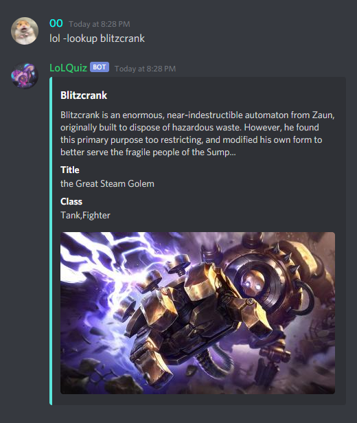
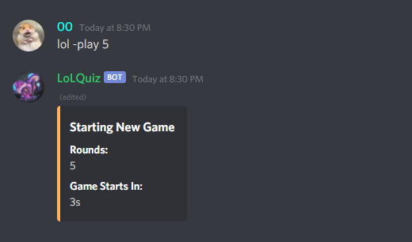
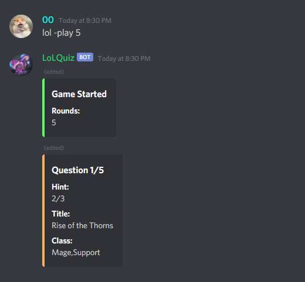
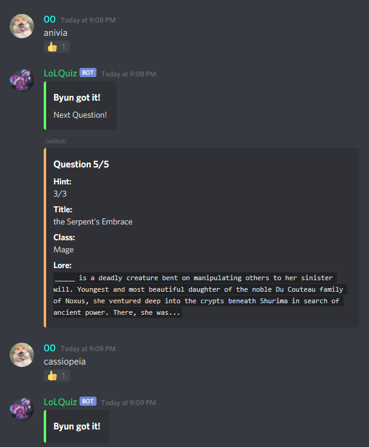

# lolquiz

### About
Simple Discord Bot that can look up League of Legends champion data and generate trivia questions.

---

### To add to your own server
- Create a discord bot at https://discord.com/developers/applications
- Add your bot to your server and have the token ready for later
- Clone repository
- ```cd lolquiz```
- ```npm install --save discord.js```
- Create file called token.js and just add this line
	- ```module.exports = "token";```
	- Make sure that you replace the word **token** with your own bot's token.
- ```node app.js```
- It should be live

---

### Commands

- All commands start with ```lol``` followed by a tag and any following inputs if needed.
- Any command can be shortened to simply the first character of the phrase.
- e.g. ```lol -help``` -> ```lol -h```.

| Action | Command Tag | Extra Inputs |
| ----------- | ----------- | ----------- |
| Get list of commands | -help | *N/A* |
| Look up champion information | -lookup | Champion Name |
| Play game | -play | Number of Rounds |

---

### Screenshot




